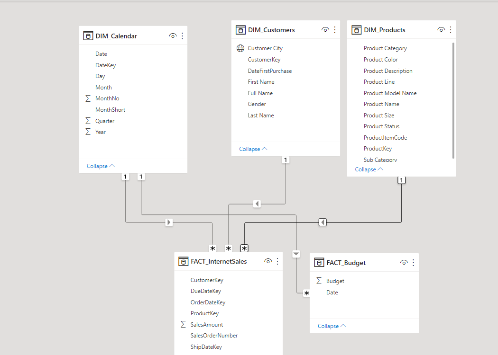
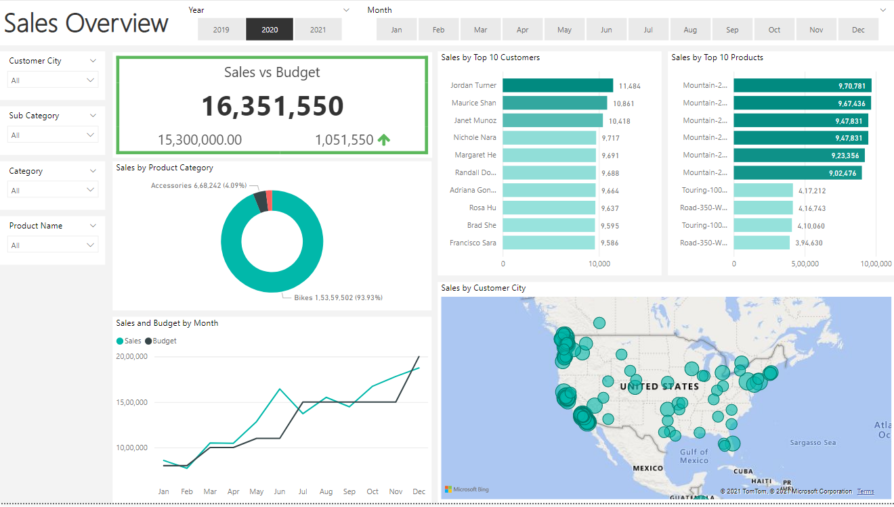
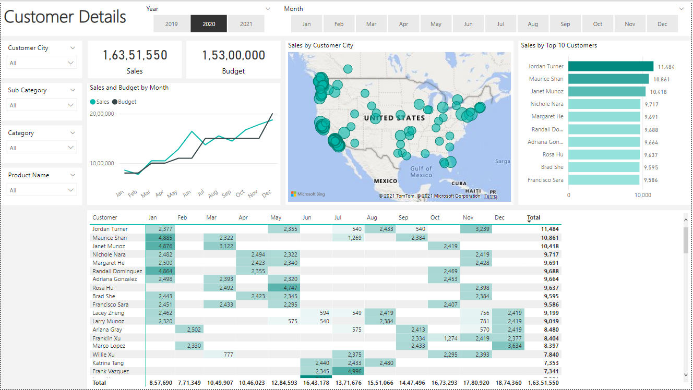
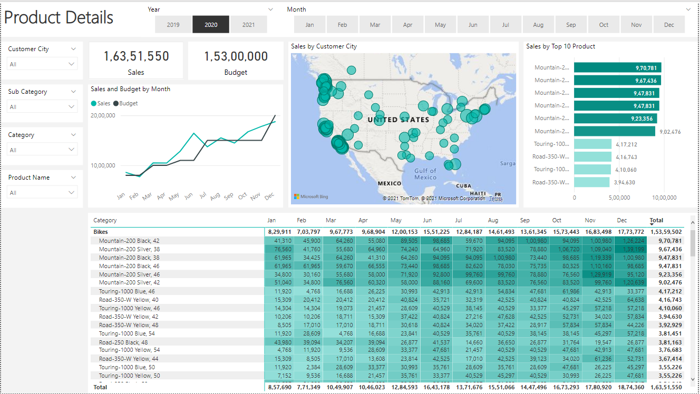

# Sales Analysis & Budget Management Dashboard

## Project Overview

The Sales Analysis & Budget Management Dashboard is a Data Analytics and Business Intelligence project developed using SQL Server and Power BI.

The objective of this project was to transform raw sales data into actionable business insights through data preparation, modeling, visualization, and KPI reporting. The solution enables users to monitor sales performance, evaluate budget utilization, identify top-performing customers and products, and analyze business trends through interactive dashboards.

The project demonstrates the complete data analytics workflow, including data extraction, cleansing, transformation, star schema modeling, DAX measure creation, and dashboard development.

---

## Business Problem

Organizations generate large volumes of sales data every day, but traditional reporting methods often fail to provide meaningful insights quickly.

Common challenges include:

- Difficulty identifying top-performing customers and products.
- Limited visibility into sales trends over time.
- Lack of comparison between actual sales and budget targets.
- Time-consuming manual reporting.
- Limited ability to perform interactive analysis.

To address these challenges, an interactive Power BI reporting solution was developed to provide stakeholders with actionable insights and support data-driven decision-making.

---

## Project Objectives

The primary objectives of this project were:

- Analyze sales performance across different time periods.
- Compare actual sales against budget targets.
- Identify top-performing customers.
- Identify best-selling products.
- Monitor business performance using KPIs.
- Analyze geographical sales distribution.
- Enable interactive reporting and self-service analytics.

---

## Dataset Overview

The project utilizes sales, customer, product, calendar, and budget datasets.

### Fact Tables

#### FACT_InternetSales

Contains transactional sales information including:

- Customer Key
- Product Key
- Order Date Key
- Sales Amount
- Sales Order Number

#### FACT_Budget

Contains budget allocation information used to compare planned targets with actual sales performance.

### Dimension Tables

#### DIM_Customers

Contains customer information used for customer analysis and segmentation.

#### DIM_Products

Contains product information used for product performance analysis.

#### DIM_Calendar

Contains date-related information used for trend analysis and time intelligence reporting.

---

## Data Preparation

SQL Server was used to prepare the data before loading it into Power BI.

The preparation process included:

- Data extraction
- Data cleansing
- Data transformation
- Data validation
- Business-friendly column creation

The transformed data was then imported into Power BI for analysis and visualization.

---

## Data Modeling

A Star Schema data model was implemented to improve reporting performance and simplify analysis.

### Data Model



The model consists of two fact tables and three dimension tables connected through one-to-many relationships.

### Benefits of Star Schema

- Faster query performance
- Improved dashboard responsiveness
- Simplified reporting
- Better scalability
- Easier maintenance

---

## DAX Measures

Several DAX measures were created to support KPI reporting and business analysis.

### Total Sales

```DAX
Sales =
SUM ( FACT_InternetSales[SalesAmount] )
```

### Total Budget

```DAX
Budget =
SUM ( FACT_Budget[Budget] )
```

### Profit Variance

```DAX
Profit =
[Sales] - [Budget]
```

---

## Dashboard Pages

### 1. Sales Overview Dashboard

The Sales Overview dashboard provides a consolidated view of overall business performance.



#### Key Features

- Sales vs Budget KPI
- Product Category Analysis
- Top 10 Customers
- Top 10 Products
- Monthly Sales Trend Analysis
- Geographic Sales Distribution
- Year and Month Filters

#### Business Value

Provides management with a quick overview of business performance and helps identify growth opportunities.

---

### 2. Customer Details Dashboard

The Customer Details dashboard focuses on customer-level analysis and purchasing behavior.



#### Key Features

- Top Customers by Revenue
- Monthly Customer Sales Analysis
- Customer Revenue Contribution
- Budget Comparison
- Customer-Based Filtering

#### Business Value

Helps identify high-value customers and supports customer retention strategies.

---

### 3. Product Details Dashboard

The Product Details dashboard focuses on product-level performance analysis.



#### Key Features

- Top Products by Revenue
- Product Performance Trends
- Monthly Product Analysis
- Budget Comparison
- Product-Based Filtering

#### Business Value

Supports product performance evaluation, sales optimization, and inventory planning.

---

## Key Performance Indicators (KPIs)

The dashboard tracks several important business metrics:

- Total Sales
- Budget
- Profit Variance
- Top 10 Customers
- Top 10 Products
- Product Category Performance
- Sales Trend Analysis
- Geographic Sales Distribution

---

## Key Insights

The dashboard enables users to:

- Identify top-performing customers and products.
- Compare sales against budget targets.
- Monitor monthly and yearly sales trends.
- Analyze product category contribution.
- Evaluate customer purchasing behavior.
- Understand regional sales performance.

---

## Tools & Technologies Used

- Power BI
- SQL Server
- SQL
- DAX
- Microsoft Excel

---

## Skills Demonstrated

### Data Analysis
- SQL Querying
- Data Cleaning
- Data Transformation
- Data Validation

### Data Modeling
- Star Schema Design
- Fact and Dimension Modeling
- Relationship Management

### Data Visualization
- Dashboard Development
- KPI Reporting
- Interactive Reporting
- Data Storytelling

### Business Intelligence
- DAX Measure Creation
- Trend Analysis
- Performance Monitoring

---

## Project Outcome

Successfully developed an interactive Power BI dashboard for sales and budget analysis.

The solution provides visibility into customer performance, product performance, budget tracking, and sales trends, enabling stakeholders to make informed business decisions through data-driven insights.

---
